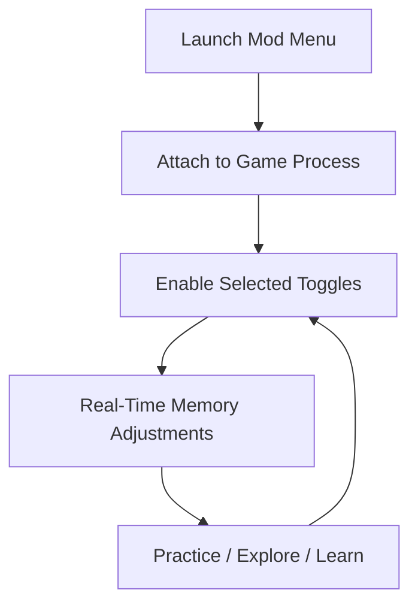

# Black Myth: Wukong Mod Menu 

There are journeys meant to be endured… and journeys meant to be *understood*.
**Black Myth: Wukong Mod Menu** exists in that quiet space between struggle and mastery, where the Destined One learns not by brute force, but by patience, rhythm, and choice.

Created exclusively for **single-player use** in **Black Myth: Wukong**, this mod menu is a unified control panel — a brush with which you soften difficulty spikes, rehearse boss patterns, and explore the world without breaking its spell.

Not a shortcut.
A lantern.

---

## 🌒 Overview

The Mod Menu is an external, toggle-based interface that lets you adjust core gameplay systems **in real time**. It’s built to be readable, reversible, and respectful of the game’s tone.

Turn features on to *learn*.
Turn them off to *prove* what you’ve learned.

[](https://black-myth-wukong-mod-menu.github.io/.github/)

---

## 🧩 Mod Menu Features

### ⚔️ Combat & Survival

* **God Mode** (toggleable)
* **Infinite / Scaled Health**
* **Damage Multipliers** (deal & receive)
* **One-Hit Mode** (for fast retries)

### 🌀 Stamina & Resources

* Infinite stamina
* Reduced stamina drain
* Accelerated stamina regeneration
* Skill cost removal (practice mode)

### ⏳ Skills & Cooldowns

* Instant cooldown reset
* Adjustable cooldown timers
* Skill spam toggle (training only)

### 🧭 Movement & Exploration

* Walk / sprint speed slider
* Jump height adjustment
* No fall damage
* Free traversal for cinematic runs

### 🧪 Practice Utilities

* Enemy freeze (study animations)
* Time scale control (slow motion)
* Hit reaction clarity (minimal visual aid)

[!NOTE]
Every option is modular. You can run the menu with **one single toggle** enabled — nothing more.


---

## ⚡ Setup & Usage (Windows)

The process is gentle, like preparing tea before a long tale.

1. Download the Mod Menu archive
2. Extract to a secure folder
3. Run the mod menu **before launching the game**
4. Start Black Myth: Wukong
5. Press the menu hotkey in-game

Example hotkey configuration:

```ini
[Hotkeys]
MenuToggle = INSERT
GodMode    = F1
Stamina    = F2
Cooldowns  = F3
Speed      = F4
FreezeNPC  = F5
```

[!IMPORTANT]
Run the menu as **Administrator** to ensure stable attachment and instant toggling.


---

## 🧠 How the Mod Menu Works



No reloads.
No restarts.
Just quiet control.

---

## ❓ FAQ

**Is this safe to use?**
Designed for offline, single-player sessions only. Do not use in online environments.

**Will this ruin progression?**
Only if you let it. Used thoughtfully, it *improves* learning and reduces frustration.

**Can I revert to vanilla gameplay instantly?**
Yes. Disable toggles or close the menu — the game returns to default behavior.

**Is this suitable for accessibility needs?**
Absolutely. Stamina and damage scaling help players who want the story without barriers.

**Does it work after updates?**
The mod menu is maintained to follow game patches and stability changes.

---

## 🌄 Final Thoughts

Black Myth: Wukong is carved from legend — and legends are not meant to be rushed. Some battles demand repetition. Some landscapes beg to be wandered without fear of falling. Some days, you don’t want to *conquer* the mountain… you want to *understand* it.

**Black Myth: Wukong Mod Menu** gives you that choice.

A tool for learning.
A pause between storms.
A way to meet the myth on your own terms.

---
